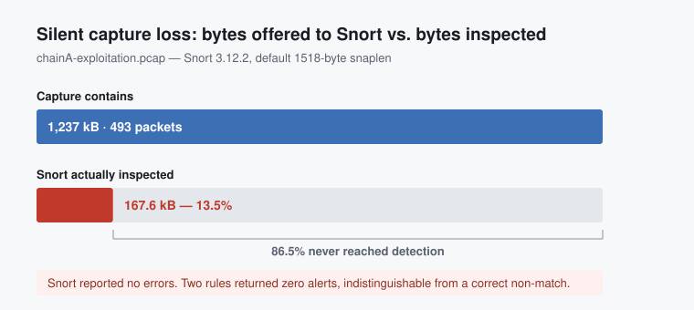
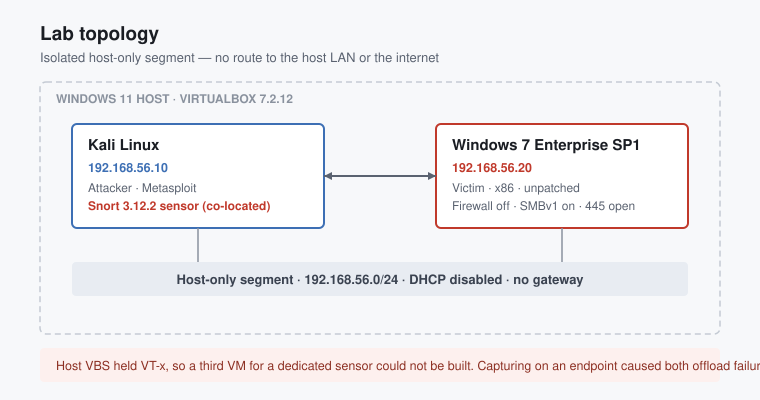
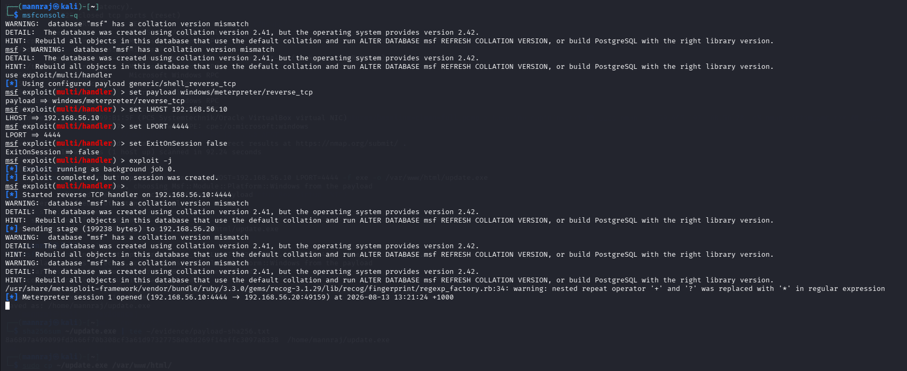
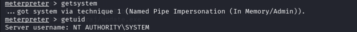
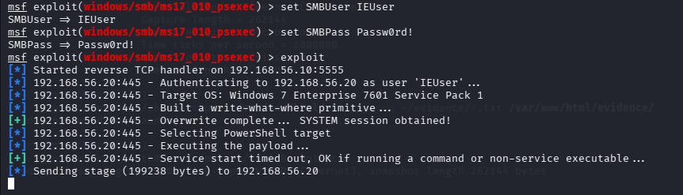
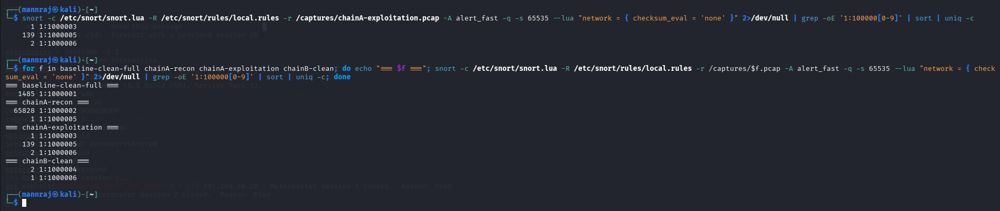

# Purple Team Lab

**Exploitation, detection engineering, and the measurement of both.**

Two attack chains against a Windows 7 host, six custom Snort 3 signatures written
to catch them, and a quantitative evaluation of how well those signatures
actually performed — including the cases where the sensor reported nothing while
inspecting 13% of the traffic.

---

## The finding

Signature-based intrusion detection fails in ways that are **invisible in its own
output**. A rule that never fires and a rule correctly finding nothing produce
identical results: silence.

Two of six rules initially returned zero alerts against traffic independently
confirmed — with `tshark` — to contain their exact match patterns. Neither
produced an error. The causes were not in the ruleset:



| Cause | Effect |
|---|---|
| Transmit checksum offload | 111 packets discarded before detection. All C2 and delivery traffic is outbound from the attacker, so the entire payload surface was invisible. |
| Segmentation offload + 1518-byte default snaplen | Oversized frames truncated on read, then discarded as malformed. Snort ingested **167,618 of 1,237,000 bytes**. |

Both trace to a single architectural fact: **the sensor was co-located with an
endpoint.** Capturing on a host means capturing before the NIC has finished with
the packet. An out-of-band sensor on a SPAN port or TAP observes fully-formed
frames and neither failure occurs.

That placement was not a choice. Host virtualisation-based security held the
CPU's VT-x extensions, VirtualBox fell back to its NEM backend, and a third VM
for a dedicated sensor could not be built. A constraint recorded during lab
construction as a limitation became, two phases later, a total detection failure
on exactly the traffic that mattered.

---

## Scope and authorisation

Every action documented here was performed against virtual machines built, owned
and operated by the author, on an isolated host-only network with no route to any
external system. No third-party system was involved at any point.

This repository contains detection signatures, network captures, analysis tooling
and methodology. **It contains no working payloads or exploit binaries.** Payload
generation commands and their SHA-256 hashes are published so results can be
reproduced without distributing live malware. Captured credential material is
excluded by `.gitignore` and cropped out of screenshots.

---

## Architecture



| Host | Role | Address |
|---|---|---|
| Kali Linux | Attacker + Snort 3.12.2 sensor | 192.168.56.10 |
| Windows 7 Enterprise 7601 SP1 x86 | Victim — unpatched, firewall off, SMBv1 enabled | 192.168.56.20 |

The task sheets this work derives from specify a bridged adapter. That would place
a deliberately unpatched host with its firewall disabled onto the home LAN, so
host-only was used instead and the deviation documented. The victim has one
adapter and no gateway; the attacker's NAT interface is disabled during every
capture.

---

## Attack chains

Two paths to an identical payload — which is what makes the detection comparison
controlled rather than anecdotal.

| | Chain A | Chain B |
|---|---|---|
| Initial access | User executes a downloaded executable | Remote SMB exploitation (MS17-010) |
| User interaction | Required | None |
| Credentials | None | **Required** |
| Landed as | `IE8WIN7\IEUser` | `NT AUTHORITY\SYSTEM` |
| Escalation | `getsystem` — named pipe impersonation | None needed |
| C2 port | 4444 | 5555 |
| Meterpreter stage | 199,238 bytes | 199,238 bytes |

MS17-010 is routinely described as unauthenticated and wormable. That holds for
`eternalblue` against x64 targets; the `psexec` variant this 32-bit host required
refused anonymous exploitation and succeeded only with valid SMB credentials.
Exploitability of one CVE varies by architecture and by module.

---

## Detection results

Six signatures across reconnaissance, delivery, exploitation and command-and-control.

| Rule | baseline | recon | chainA | chainB |
|---|---:|---:|---:|---:|
| 1 — ICMP echo burst | **1485** | 0 | 0 | 0 |
| 2 — TCP SYN scan | 0 | **65,828** | 0 | 0 |
| 3 — Executable over HTTP | 0 | 0 | **1** | 0 |
| 4 — SMBv1 Trans2 (MS17-010) | 0 | 0 | 0 | **2** |
| 5 — C2 matched by **port** | 0 | 1 | **139** | **0** |
| 6 — C2 matched by **content** | 0 | 0 | **2** | **1** |

**Rule 5 caught Chain A and missed Chain B entirely.** Same payload, same
199,238-byte stage, same operator, same victim — defeated by changing 4444 to
5555. Rule 6, matching the executable's content instead of its port, caught both.

The six rules span the full range of signature quality, which was not by design:

- **Rules 3, 4 and 6** — nine alerts combined, all correct, zero false positives
- **Rule 2** — perfect specificity, 65,828 alerts; correct and operationally useless
- **Rule 1** — 1,485 false positives, zero true positives

The distinguishing feature is that the effective rules matched *artefacts of the
attack* — an executable in an HTTP body, an SMB dialect, a PE header on a C2
channel — while the ineffective ones matched *volumes of ordinary protocol
behaviour*.

### Timing

Within Chain A, measured from the capture:

```
620.593 s   executable requested over HTTP
620.597 s   PE transfer observed          (+4 ms)
630.092 s   C2 channel established        (+9.499 s)
```

**9.5 seconds from download to remote control**, and that is generous — it
includes a human clicking through a browser download prompt. Every rule fired
within milliseconds of its trigger, so detection speed was never the constraint.
The constraint is that the response window is shorter than any human triage
process.

### Attack volume asymmetry

Reconnaissance produced 132,727 packets. The full compromise produced 493. A
**269:1 ratio** between the noisiest phase of the intrusion and the phase that
actually took the host — so a detection strategy tuned by alert volume optimises
for the wrong signal.

---

## What's included

```
docs/       build guide, report structure, figures, screenshots
rules/      the Snort 3 ruleset, with the required invocation documented
pcaps/      all captures — benign control, recon, both attack chains
evidence/   addressing, attack surface, capture provenance, payload hashes
scripts/    replay harness and alert-log analysis
results/    detection matrix, metrics CSV/JSON, written analysis
tests/      12 tests covering the analysis tooling
```

| Document | Contents |
|---|---|
| [Build guide](docs/00-BUILD-GUIDE.md) | Lab construction and execution procedure, design decisions, troubleshooting log |
| [Attack chains](docs/01-attack-chain.md) | Execution record, ATT&CK mapping, findings, defender's-eye view |
| [Detection engineering](docs/02-detection-engineering.md) | Rule-by-rule rationale, evasion analysis, how the silent failures were diagnosed |
| [Detection results](results/detection-matrix.md) | Alert matrix, timing, instrumentation failures |
| [Research report](docs/04-research-report.md) | The written analysis — 2,871 words, IEEE references |
| [Ruleset](rules/local.rules) | Six signatures, commented, with required flags explained |

---

## Reproducing the results

Every capture is committed, so the detection results can be reproduced without
rebuilding the lab.

```bash
python3 scripts/replay_and_score.py \
    --pcap-dir pcaps/ \
    --rules rules/local.rules \
    --config /etc/snort/snort.lua \
    --out results/ \
    --exclude 'baseline-clean.pcap' \
    --exclude 'baseline-smb.pcap' \
    --exclude 'chainA-run1.pcap' \
    --exclude 'chainB-run1.pcap'
```

The exclusions drop captures superseded by a trim or merge. Scoring a parent
capture alongside the captures derived from it counts the same packets twice —
the first run of this tool reported 2,970 false positives instead of 1,485 for
exactly that reason.

Requires Snort 3.12+. The tooling is standard library only.

```bash
python -m pytest tests/ -v
```

---

## Evidence

| | |
|---|---|
|  | **Chain A** — session established after the user runs the dropper |
|  | **Chain A** — `IEUser` to `NT AUTHORITY\SYSTEM` via named pipe impersonation |
|  | **Chain B** — remote exploitation, SYSTEM without user interaction |
|  | **Detection** — full ruleset replayed across all four captures |

Further screenshots in [`docs/screenshots/`](docs/screenshots/).

---

## Author

**Manraj Singh Makin** — [github.com/Mannraj5](https://github.com/Mannraj5)

## License

[MIT](LICENSE)
